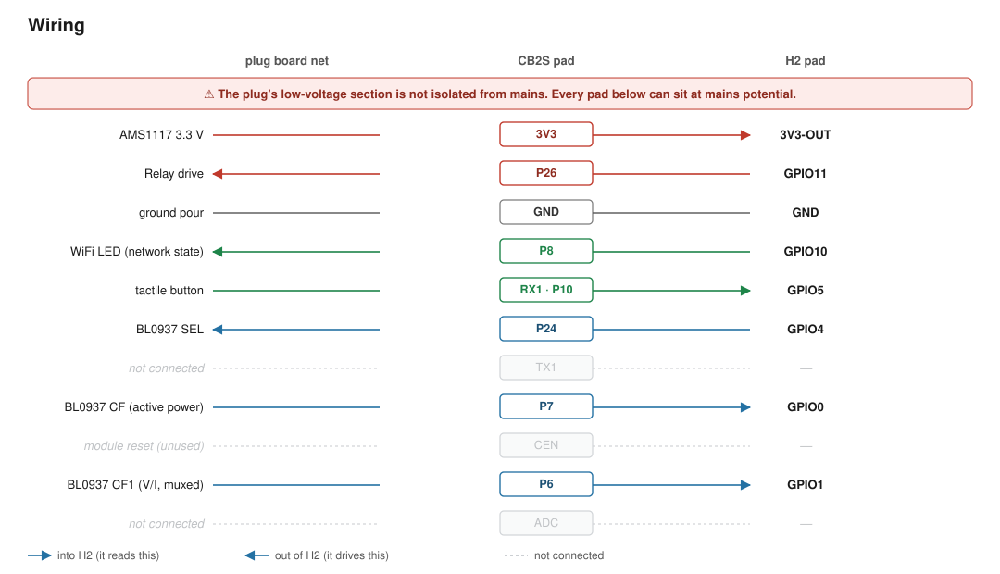

# CB2S Smart Plug — Reverse Engineering Notes

Findings from analysing a Tuya-based energy-metering smart plug built around a
**CB2S** module (Beken **BK7231N**, Cortex-M4F @ 120 MHz, 256 KB SRAM, 2 MB SPI flash).

Goal: document the measured hardware mapping and calibration details for a custom
Matter-over-WiFi build.

---

## Device summary

| Property | Value |
|---|---|
| Module | CB2S (BK7231N) |
| Friendly name | `Arbeitszimmer Power Switch` |
| Channels | 1 relay |
| Energy metering | **Yes** — BL0937 |
| Original Tuya product key | `keyjup78v54myhan` |
| Original Tuya schema id | `000004fhhe` |

Residual Tuya strings (`oem_cfg`, `tuya.device.timer...` log fragments) survive in
unerased sectors from the factory image and are not used as the authoritative pin map.

---

## Measured pinout

This is the measured hardware wiring and should be treated as the authoritative mapping:

| Signal | Measured pin |
|---|---|
| BL0937 `CF1` | **P6** |
| BL0937 `CF` | **P7** |
| WiFi LED | **P8** |
| Button | **P10** |
| BL0937 `SEL` | **P24** |
| Relay | **P26** |

> **Recommended before flashing:** confirm empirically. Toggle `SEL` and check that
> the `CF1` frequency changes character — that distinguishes `SEL` from `CF`
> by measurement rather than by offset inference.

---

## Wiring — replacing the CB2S with a XIAO ESP32-C6

This repo now also carries a Matter firmware (`main/`) targeting a **Seeed Studio
XIAO ESP32-C6**, wired into the vacated CB2S footprint after the CB2S module is
desoldered. See [CLAUDE.md](CLAUDE.md) for the firmware build/flash workflow.

> **⚠️ Mains safety.** This plug's low-voltage section is **not isolated from
> mains** — the BL0937's ground sits at mains potential, so every pad on the
> CB2S footprint can be live. Never connect USB to the XIAO while the plug is
> connected to mains, and never probe or rework the board while it is plugged
> in. Use an isolation transformer for any bring-up that needs mains present,
> and discharge the bulk capacitor before handling the board.

**Not a drop-in.** The CB2S module is ≈15 × 18 mm with a single row of
castellated pads along one edge; the XIAO ESP32-C6 is ≈21 × 17.5 mm with two
2.54 mm headers on opposite long edges, plus a USB-C connector and antenna
that need clearance. This is a flying-wire rework — the CB2S is desoldered,
the XIAO is mounted wherever it fits inside the enclosure, and each signal is
run as an individual wire from the vacated footprint pad to the corresponding
XIAO pad. Check clearance to mains-carrying copper before fixing the XIAO in
place.

**Power.** The plug's AMS1117 3.3 V rail feeds the XIAO's **3V3** pad,
back-feeding the XIAO's own regulator output. Do **not** use the XIAO's
5V/VBUS pad for this — that pad is the *input* to the XIAO's onboard LDO, and
3.3 V there sits below the regulator's dropout voltage, so the board will
brown out or run marginally. The AMS1117's headroom for the ESP32-C6's WiFi/
Thread radio's current peaks has not been measured; add bulk capacitance at
the XIAO's 3V3 pad if it browns out under radio load.

**The `RX1` pad carries the button, not a UART line.** The measured pinout
above puts the button on **P10**; on this module, P10 is the internal BK7231N
pin brought out to the pad silkscreened `RX1` (confirmed against the plug's
schematic) — a naming leftover from the module's UART1, not an indication
that anything UART-related is wired there.

### Pin assignment

Six signals, plus power and ground, land on real, reachable footprint pads —
no PCB rework needed. Grouped so the BL0937 signals are contiguous and the
relay sits furthest from the pulse-counting inputs to reduce switching-noise
coupling:

| Plug net | CB2S pad | Direction (XIAO's view) | XIAO pad | GPIO |
|---|---|---|---|---|
| BL0937 `CF` (active power) | `P7` | in — pulse count | **D0** | GPIO0 |
| BL0937 `CF1` (V/I, muxed) | `P6` | in — pulse count | **D1** | GPIO1 |
| BL0937 `SEL` | `P24` | **out** — XIAO drives the mux | **D2** | GPIO2 |
| Button | `RX1` (= P10) | in — pull-up, edge | **D3** | GPIO21 |
| WiFi LED (repurposed as network LED) | `P8` | out | **D4** | GPIO22 |
| Relay | `P26` | out | **D5** | GPIO23 |
| 3.3 V rail | `3V3` | power in | **3V3** | — |
| Ground | `GND` | ↔ | **GND** | — |
| — | `CEN`, `ADC`, `TX1` | — | *not connected* | — |

XIAO-side pin choices are ours, since the two boards are joined by hand
rather than sharing a connector. Constraints applied:

- **D6/D7 (GPIO16/17) are deliberately left unused** — these are the
  ESP32-C6's default console UART0 pins. Wiring a signal there crash-loops
  the console the moment the peripheral driver also claims them.
- None of D0–D10 are ESP32-C6 strapping pins (GPIO4/5/8/9/15, which sit on
  the XIAO's MTMS/MTDI/Boot/Light pads — none used by this design), so none
  of the choices above affect boot behaviour.



Each arrow points in the direction the signal actually flows: into the XIAO
for `CF`, `CF1`, and the button (the XIAO reads them), out of the XIAO for
`SEL`, the LED, and the relay (the XIAO drives them). Plain lines with no
arrowhead are power/ground; dotted grey rows are the three footprint pads
this design leaves unconnected.

### Bench verification checklist

- [ ] Continuity-check all 11 footprint pads to their nets **before**
      desoldering the CB2S — the pad↔net mapping above is inferred from the
      measured *pin* map, not probed at the *pad* itself.
- [ ] Confirm `CEN` and `ADC` are genuinely unused on this PCB (`CEN` is
      likely pulled high; check whether anything else rides that net).
- [ ] Confirm the AMS1117 sustains the ESP32-C6's WiFi/Thread radio peak
      current without browning out.
- [ ] Confirm the relay is **de-energised through XIAO boot** — check the
      pad's state across reset *before* wiring it to a live load.
- [ ] Confirm the plug's LED polarity (assumed active-high in firmware;
      verify on the bench).
- [ ] Confirm `SEL` polarity and `CF1` settling time after each toggle — see
      the calibration note in [CLAUDE.md](CLAUDE.md); the firmware currently
      ships with an **unverified placeholder** for this.
- [ ] Re-derive this unit's BL0937 calibration divisors against a real load
      with an isolation transformer — the coefficients recovered above (§
      Calibration coefficients) are Tuya-format multipliers, not the
      counts-per-second-per-unit divisors the firmware's driver expects, and
      belong to this unit's specific shunt in any case.
- [ ] Verify physical fit and clearance from mains-carrying copper and from
      the relay/shunt to the XIAO's antenna.

---

## Power metering — BL0937

The plug uses a **BL0937** (HLW8012-compatible) energy-metering front end. It has no
digital bus — output is **pulse-frequency** only, so reading it means counting edges:

- **`CF` (P7)** — free-running; pulse frequency ∝ **active power**.
- **`CF1` (P6)** — multiplexed; frequency ∝ **voltage** *or* **current**.
- **`SEL` (P24)** — selects which quantity `CF1` currently carries.

Firmware must toggle `SEL` periodically, allow a settling delay, discard the first
samples after each switch, and attribute each measurement window to the right quantity.
Implementation needs GPIO interrupts or a capture timer — there is no I²C/SPI/UART.

### Calibration coefficients

Recovered from the device configuration block at `0x1D1538` (little-endian floats):

| Offset | Value | Meaning |
|---|---|---|
| `0x1D1544` | `1.0` | voltage multiplier |
| `0x1D1548` | `2.2` | current multiplier |
| `0x1D154C` | `0.1` | power multiplier |
| `0x1D1550` | `0.1` | energy multiplier |

These are **specific to this unit's shunt** and will be erased along with the config
block when new firmware is flashed. Record them before flashing.

Corroborating values from the Tuya config in `info.txt`: `resistor: 1`,
`over_cur: 17000`, `over_vol: 280`, `lose_vol: 80` — consistent with a standard
shunt-based 230 V module.

---

## Flash layout

| Region | Contents |
|---|---|
| `0x000000`–`0x110000` | Application image |
| `0x110000`–`0x1D0000` | Erased (`0xFF`) |
| `0x1D1000` | Configuration block — WiFi creds, MQTT, pin roles, calibration |
| `0x1D2000` | Device key/value store (`log_seq_stat`, `temp_energy`, `day_energy`, `measure_coe`, `measure_rslt`, `RLY_STAT`) |
| `0x1EE000` | Tuya config region (stock layout, per `info.txt`) |

Stock Tuya BK7231N app images are stored **XOR-encrypted** in flash; the config
regions near `0x1D0000` are plaintext. The app region in this dump is not relevant to
this measured pinout note and is intentionally not described as firmware-specific history.

---

## Datapoints declared by the original Tuya schema

Schema `000004fhhe` — retained for reference, as it documents what the hardware can report.

| DP | Type | Meaning |
|---|---|---|
| 1  | bool | Switch |
| 9  | value | Countdown (0–86400 s) |
| 17 | value | Energy, scale 3 (0–50000) |
| 18 | value | Current, mA (0–30000) |
| 19 | value | Power, scale 1 (0–80000) |
| 20 | value | Voltage, scale 1 (0–5000) |
| 21 | value | Test bit (0–5) |
| 22–25 | value | Calibration / accumulated counters |
| 26 | bitmap | Fault flags |
| 38 | enum | Power-on state — `off` / `on` / `memory` |
| 39 | bool | Overcharge switch |
| 40 | enum | Indicator mode — `relay` / `pos` / `none` / `on` |
| 41 | bool | Child lock |
| 42–44 | string | Cycle / random / inching schedule |

---

## Other devices analysed

Two further dumps were examined; both are **stock Tuya** (encrypted app image,
plaintext TLV config at `0x1D0000`) and **neither has power metering** — no
`ele_pin`, `vi_pin`, `sel_pin_pin`, `ele_fun_en`, or `resistor` keys.

| | Metering plug (this doc) | `smartswitch10a` | `lspa10` |
|---|---|---|---|
| Relay | P26 | P7 | P26 |
| Button | P10 | P23 | P10 |
| WiFi LED | P8 | P26 | P8 |
| BL0937 SEL / CF1 / CF | P24 / P6 / P7 | — | — |
| Metering | ✅ | ❌ | ❌ |

`lspa10` raw config:
```
{reset_t:5,netled1_pin:8,rl1_lv:1,bt_type:0,bt1_pin:10,module:CB2S,net_trig:2,
 ch_cddpid1:9,jv:1.0.2,netled1_lv:0,netled_reuse:0,ffc_select:0,nety_led:1,
 ch_num:1,total_stat:2,rl1_pin:26,netn_led:0,ch_dpid1:1,bt1_lv:0,crc:52,}
```

`smartswitch10a` raw config:
```
{rl1_lv:1,on_off_cnt:10,onoff_rst_m:1,onoff_clear_t:10,rand_dpid:42,net_trig:2,
 onoff_n:3,netled1_lv:0,jv:110.0.0,onoff_rst_type:2,ffc_select:0,total_bt_pin:23,
 nety_led:2,total_stat:2,reset_t:5,netled1_pin:26,remote_add_dp:49,remote_list_dp:50,
 net_type:0,inch_dp:44,module:CB2S,ch_cddpid1:9,inch_en1:0,onoff1:6,clean_t:5,
 init_conf:38,zero_select:0,onoff_type:0,series_ctrl:0,total_bt_lv:0,cyc_dpid:43,
 ch_num:1,rl1_pin:7,netn_led:2,ch_dpid1:1,crc:69,}
```

Note that `lspa10`'s relay/button/LED pins (26 / 10 / 8) coincidentally match the
values `info.txt` lists — both are common CB2S reference layouts. `info.txt`
nonetheless describes the **metering** device, since it also carries the BL0937 pins
and DPs 17–25 that `lspa10` does not have.

---

## ⚠️ Backup status

The flash images for all three devices were removed from the working tree during
analysis. **There is currently no restorable backup of the metering plug.** The pin
map and calibration coefficients above were recovered before deletion, but the image
itself is gone.

Re-dump any device before flashing it:

```sh
# read full 2 MB flash via UART1 (RX1/TX1 on the module's back edge)
bk7231tools read_flash -d /dev/ttyUSB0 -s 0x0 -c 0x200000 backup.bin
```

---

## How these findings were derived

```sh
# locate config block and decode pin roles
python3 - <<'EOF'
d = open('dump.bin','rb').read()
base = 0x1D133E
roles, chans = d[base:base+32], d[base+32:base+64]
NAMES = {1:"Button", 3:"Relay", 9:"WifiLED_n",
         17:"BL0937 CF", 18:"BL0937 CF1", 19:"BL0937 SEL"}
for pin, role in enumerate(roles):
    if role:
        print(f"P{pin:<3} role={role:<3} {NAMES.get(role,'?'):<14} ch={chans[pin]}")
EOF
```

---

## References

- [LibreTiny — Beken BK72xx](https://docs.libretiny.eu/docs/platform/beken-72xx/)
- [BK7231 datasheet / pinout / programming](https://www.elektroda.com/news/news3951016.html)
- [tuya-iotos-embeded-sdk-wifi-ble-bk7231n](https://github.com/tuya/tuya-iotos-embeded-sdk-wifi-ble-bk7231n)
